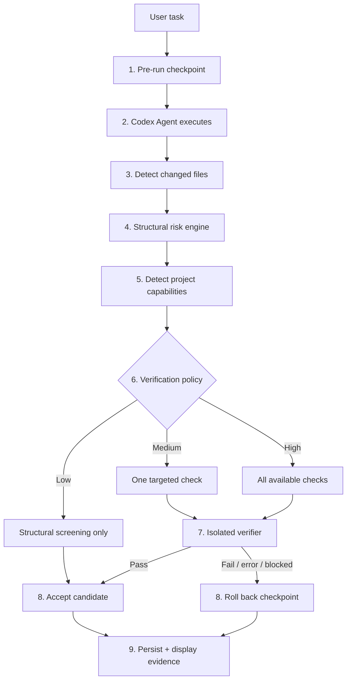
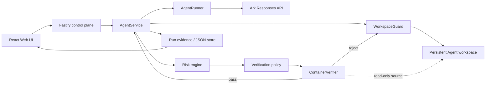

# Adaptive SafeCommit

> Risk-aware verification and transactional rollback middleware for autonomous coding Agents.

Adaptive SafeCommit extends the **Volc Agent Launchpad** starter platform for
TikTok TechJam 2026 Track 1. The starter's Agent CRUD, browser Playground,
persistent workspaces, Codex CLI runtime, and Ark model integration remain in
place. SafeCommit adds a middleware layer that decides whether Agent-generated
workspace changes are safe enough to keep.

The core idea is simple: **treat every Agent change as speculative until the
platform has independently assessed and verified it**.

```text
checkpoint -> Agent execution -> diff -> risk -> verification -> accept
                                                      |
                                                      +----> reject -> rollback
```

SafeCommit deliberately spends verification compute in proportion to structural
risk:

| Risk tier | Current policy | Outcome when verification is unavailable |
| --- | --- | --- |
| **Low** (`score < 30`) | Deterministic structural analysis only; 0 executable checks | Accept after structural screening |
| **Medium** (`30 <= score < 60`) | Run one targeted check, preferring `test`, then `typecheck`, then `build` | Fall back to structural screening |
| **High** (`score >= 60`) | Run every available check in `typecheck -> test -> build` order | **Fail closed** and roll back |

Verification stops after the first failed executable check because the candidate
has already been proven unsafe; later checks would spend compute without
changing the decision.

## Why SafeCommit

Coding Agents can edit files and run tools autonomously, but a successful model
response does not imply that the resulting workspace is safe to persist. A
platform needs an independent control point between **"the Agent finished"** and
**"the change becomes durable"**.

SafeCommit provides that control point with four properties:

1. **Recoverability** — every run starts from a control-plane checkpoint.
2. **Explainability** — structural risk signals and scores are deterministic and
   visible.
3. **Cost adaptation** — low-risk changes avoid unnecessary executable checks,
   while higher-risk changes receive more scrutiny.
4. **Independent verification** — executable checks run outside the Agent's own
   execution context and cannot silently mutate the authoritative workspace.

## What we added to the starter

| Area | Starter platform | Adaptive SafeCommit extension |
| --- | --- | --- |
| Agent lifecycle | Create, edit, start, stop, delete | Preserved |
| Playground | Multi-turn Codex chat | Preserved |
| Workspace | Persistent per-Agent directory | Pre-run checkpoint, diff, rollback |
| Model runtime | Codex CLI + Ark | Preserved; model is not used to judge its own output |
| Risk analysis | Not present | Deterministic structural classifier |
| Verification routing | Not present | Low / medium / high adaptive policy |
| Verification runtime | Not present | Credential-free, network-isolated container verifier |
| Recovery | Run failure state | Failed/cancelled/rejected changes roll back when a checkpoint exists |
| Evidence | Generic run status | Risk score, reasons, changed files, plan, check results, rollback outcome |
| UI | Agent conversation | SafeCommit evidence card before the latest Agent response |

## SafeCommit flow



### 1. Transactional workspace checkpoint

Before the Agent runs, `WorkspaceGuard` creates a per-Agent checkpoint using a
control-plane-owned bare Git repository. Git metadata is kept outside the Agent
workspace and is not mounted into the Agent runtime.

After execution, SafeCommit compares the workspace against that checkpoint. A
rejected run resets tracked files and removes newly-created untracked files.

### 2. Deterministic structural risk analysis

`change-risk-engine.ts` scores the changed-file set using explainable signals
such as:

- executable source changes;
- test changes;
- dependency manifests or lockfiles;
- security-sensitive paths such as auth, token, session, credential, or crypto;
- persistence/database paths;
- infrastructure/deployment files;
- configuration files;
- larger change sets.

Scores are additive and capped at 100. The evidence UI displays both the score
and the reasons that produced it.

### 3. Capability-aware verification policy

SafeCommit currently detects npm projects by reading `package.json` and looking
for these scripts:

```text
typecheck
test
build
```

The policy then selects the cheapest verification tier appropriate for the
change. Medium risk prefers a behavioural test when available. High risk uses
all available checks and fails closed when no executable check is available.

### 4. Independent verifier

Executable checks run in a separate container with a deliberately narrower
trust boundary than the Agent runtime:

- `--network none`;
- `--security-opt no-new-privileges`;
- `--cap-drop ALL`;
- non-root configured user;
- read-only container root filesystem;
- authoritative Agent workspace mounted **read-only** at `/workspace-src`;
- disposable writable `/workspace` backed by tmpfs;
- no `ARK_API_KEY` passed to the verifier;
- no Codex home/session mounted into the verifier;
- CPU, memory, PID, timeout, and output limits.

The candidate source is copied into the disposable tmpfs workspace before the
check runs. Verifier side effects disappear when the container exits instead of
modifying the authoritative Agent workspace.

### 5. Evidence and recovery

Each `AgentRun` can persist:

```text
riskAssessment
verificationPlan
verificationResult
```

The Web UI turns those fields into an evidence card showing:

- LOW / MEDIUM / HIGH and numeric score;
- deterministic risk reasons;
- changed files;
- structural / targeted / full verification policy;
- planned versus executed checks;
- per-check pass/fail state and duration;
- accepted, blocked, rejected, or rolled-back outcome.

For a high-risk run, a failed check can therefore appear as:

```text
HIGH RISK 100/100                         ROLLED BACK

Verification: Full
  ✓ typecheck        831 ms
  ✕ test             1.42 s
  ○ build            not run

Change rejected
Workspace restored to the pre-run checkpoint.
```

## Architecture

The detailed architecture, trust boundaries, failure semantics, and run sequence
are documented in [docs/ARCHITECTURE.md](docs/ARCHITECTURE.md).

At a high level:



## Quick start

### Requirements

- Node.js 22+
- npm 10+
- Docker, Colima, or Podman
- an Ark API key and a Responses-compatible endpoint/model

Codex CLI is included in the Runtime image for the local POC.

### Run the local POC

```bash
git clone https://github.com/HXong/CodeJam.git
cd CodeJam
npm install

ARK_API_KEY=your-ark-api-key \
ARK_MODEL=ep-your-endpoint-id \
npm run poc
```

Open <http://localhost:3000>.

The local POC automatically selects Docker, Colima, or Podman, builds the Agent
Runtime image, and keeps persistent state between restarts.

- Linux state: `.local/`
- macOS state: `~/.volc-agent-launchpad/`
- custom state root: set `LOCAL_POC_DATA_ROOT`

To force Podman:

```bash
CONTAINER_ENGINE=podman \
ARK_API_KEY=your-ark-api-key \
ARK_MODEL=ep-your-endpoint-id \
npm run poc
```

More local-runtime details are in [docs/LOCAL_POC.md](docs/LOCAL_POC.md).

## Validation

Run the normal repository checks:

```bash
npm run check
```

This performs workspace typechecking, server tests, and production builds.

The real Docker verifier isolation test is intentionally opt-in so normal unit
tests do not require a running container engine:

```bash
RUN_SAFECOMMIT_CONTAINER_TEST=1 \
npm run test -w @launchpad/server -- src/container-verifier.test.ts
```

That smoke test executes a real verification script which writes a side-effect
file inside the verifier workspace, then asserts that the file did **not** appear
in the authoritative host workspace.

## Configuration

Key SafeCommit and runtime variables:

| Variable | Default | Purpose |
| --- | --- | --- |
| `ARK_API_KEY` | Required for Agent execution | Ark model API key; not forwarded to the verifier |
| `ARK_MODEL` | Required for Agent execution | Responses-compatible endpoint/model ID |
| `ARK_BASE_URL` | Volcengine Beijing v3 endpoint | Ark-compatible API base URL |
| `RUNTIME_PROVIDER` | `local-process` | `container` for disposable local Agent Runtime containers |
| `CONTAINER_ENGINE` | `docker` | Docker/Podman-compatible CLI |
| `CONTAINER_RUNTIME_IMAGE` | `volc-agent-runtime:local` | Image used by Agent runtime and SafeCommit verifier |
| `CONTAINER_CPU_LIMIT` | `2` | Runtime/verifier CPU limit |
| `CONTAINER_MEMORY_LIMIT` | `2g` | Runtime/verifier memory limit |
| `CONTAINER_PIDS_LIMIT` | `256` | Runtime/verifier PID limit |
| `SAFECOMMIT_VERIFY_TIMEOUT_MS` | `120000` | Maximum duration of one verification check |
| `SAFECOMMIT_VERIFY_MAX_OUTPUT_BYTES` | `262144` | Maximum captured verifier output |
| `APP_AUTH_TOKEN` | Empty on loopback | Shared demo token; required for non-loopback production |

See [.env.example](.env.example) for the full configuration surface.

## Deployment

The original Launchpad deployment paths remain available:

- [Local Docker / Colima / Podman](docs/LOCAL_POC.md)
- [Existing Linux ECS with Docker](docs/DEPLOYMENT.md#existing-linux-ecs)
- [Volcengine environment with Terraform](docs/DEPLOYMENT.md#terraform-deployment)

SafeCommit is integrated in `AgentService`, so the middleware applies to the
normal run lifecycle rather than a separate demonstration endpoint.

## Known limitations

This is a hackathon POC, not a production multi-tenant code-execution service.
Current limitations include:

- risk classification is deterministic and path/structure based; it does not yet
  perform semantic code-risk analysis;
- project capability detection currently supports npm `package.json` scripts
  named `typecheck`, `test`, and `build`;
- Git-ignored content such as dependency trees and generated artifacts is outside
  the checkpoint/rollback set;
- an unexpected control-plane process restart marks in-flight runs cancelled, but
  does not currently perform crash-time workspace rollback;
- the verifier uses container isolation and resource restrictions, but ordinary
  containers are not a hardened multi-tenant security boundary;
- metadata storage is a single-process JSON store.

## Future work

The current design intentionally keeps the decision path cheap and explainable.
Natural extensions are:

- semantic-model escalation only for structurally ambiguous changes;
- adapters for additional package managers and language-native test systems;
- crash-recovery markers that can roll an interrupted run back after restart;
- configurable risk weights and organization-specific policy rules;
- richer audit/telemetry export for verification cost and rollback frequency.

## Starter platform and attribution

This repository began from the **Volc Agent Launchpad** starter supplied for the
hackathon. SafeCommit preserves the starter's core Agent platform and adds the
middleware described above. Existing starter documentation remains useful for
runtime/deployment details:

- [Local POC](docs/LOCAL_POC.md)
- [Deployment](docs/DEPLOYMENT.md)
- [Security notes](SECURITY.md)
- [Hackathon extension guide](docs/HACKATHON_EXTENSION_GUIDE.md)

## License

[MIT](LICENSE)
