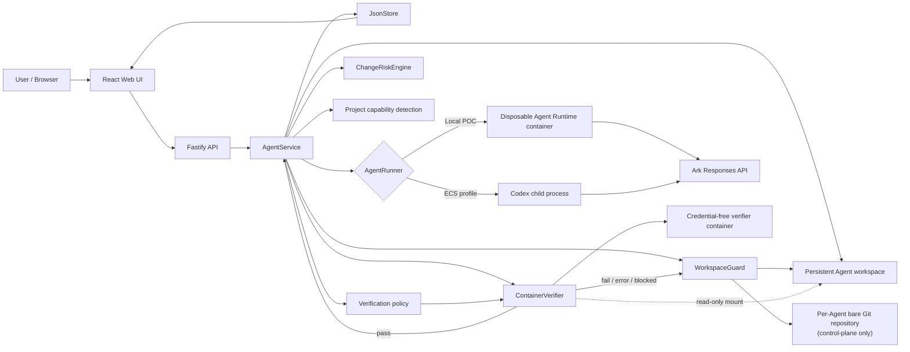
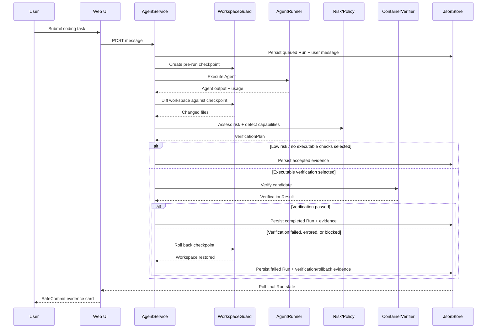
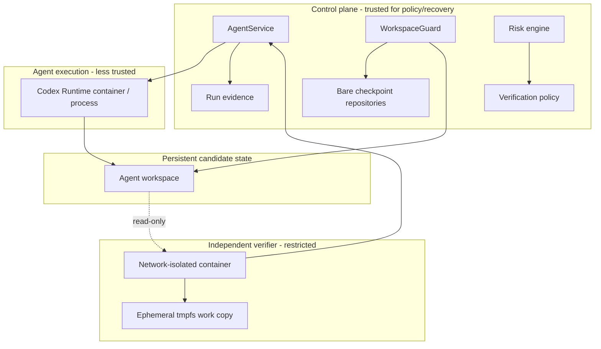

# Adaptive SafeCommit Architecture

Adaptive SafeCommit is middleware around the existing Volc Agent Launchpad run
lifecycle. It does not replace the starter platform's Agent CRUD, Playground,
persistent workspaces, Codex sessions, or Ark-backed model execution. Instead,
it inserts a control point between **Agent execution** and **durable acceptance
of the Agent's workspace changes**.

The design treats each Agent mutation as speculative:

```text
pre-run checkpoint
      -> Agent executes
      -> changed files are classified
      -> project verification capabilities are detected
      -> a risk-adaptive verification plan is selected
      -> checks execute in an isolated verifier
      -> accept OR roll back
      -> evidence is persisted and displayed
```

## System overview



## Run sequence



## Core components

### Web UI

The React UI preserves the starter Playground and Agent lifecycle controls. It
polls asynchronous Runs and renders the latest SafeCommit evidence directly from
`AgentRun` fields:

```text
riskAssessment
verificationPlan
verificationResult
```

The UI does not recalculate risk. It displays the control plane's persisted
decision evidence so that the frontend cannot silently reinterpret policy.

For the latest completed/failed run, the evidence card appears before the
Agent's potentially long natural-language response. This makes the middleware
outcome visible immediately during a short demo.

### Fastify API

The API remains the transport boundary from the starter platform. SafeCommit
requires no special demo-only endpoint: middleware is integrated into the normal
message/run path.

Remote demos may be protected with the existing shared bearer token. That token
is not user identity or fine-grained authorization.

### AgentService

`AgentService` is the orchestration point for SafeCommit. Its run lifecycle is:

```text
queued
  -> running
       -> completed   (candidate accepted)
       -> failed      (runner failure, verifier rejection/error, rollback issue)
       -> cancelled   (explicit cancellation/restart recovery state)
```

One Agent can have at most one active run.

The relevant SafeCommit dependencies are injected into `AgentService`:

```text
WorkspaceGuard
VerificationExecutor
```

Risk classification, project capability detection, verification planning, and
verification execution all occur after Agent execution but before the run is
marked completed.

A failed verifier result is converted into a run failure, which enters the same
rollback path as other post-checkpoint failures.

## Transaction boundary: WorkspaceGuard

`WorkspaceGuard` provides the speculative transaction substrate.

For each Agent it maintains a **bare Git repository outside the Agent workspace**.
The Agent's workspace is used as that repository's work tree only by the control
plane.

```text
control-plane data/
  safecommit/
    <agent-id>.git/       bare repository

workspaces/
  <agent-id>/             Agent-visible working tree
```

### Checkpoint

Before a run executes:

1. ensure the per-Agent bare repository exists;
2. `git add -A` relevant workspace content;
3. create an `--allow-empty` commit so every run receives a distinct checkpoint;
4. retain the checkpoint commit SHA in memory for the run.

### Diff

After Agent execution, SafeCommit combines:

- tracked file names from `git diff --name-only <checkpoint>`;
- untracked files from `git ls-files --others --exclude-standard`.

The resulting changed-file set feeds the risk engine.

### Rollback

If the run must be rejected after a checkpoint exists:

```text
git reset --hard <checkpoint>
git clean -fd
```

This restores tracked state and removes newly-created untracked files while
respecting Git-ignored paths.

The shadow repository is control-plane state and is not mounted into the Agent
Runtime container.

## Structural risk engine

`change-risk-engine.ts` uses deterministic file/path signals. It intentionally
does not ask the same model that authored the change whether its own output is
safe.

Current scoring signals include:

| Signal | Score contribution |
| --- | ---: |
| Documentation-only change | +5 |
| Executable source changed | +35 |
| Test code changed | +10 |
| Configuration changed | +30 |
| Infrastructure/deployment changed | +45 |
| Dependency manifest/lockfile changed | +60 |
| Persistence/database-sensitive path | +60 |
| Security-sensitive path | +65 |
| 5+ files changed | +10 |
| 10+ files changed | +10 |

The score is capped at 100.

Risk tiers:

```text
0-29    LOW
30-59   MEDIUM
60-100  HIGH
```

Examples of security-sensitive path terms include auth, authorization, token,
session, credential, secret, and crypto. Persistence signals include migration,
schema, database, db, and repository paths. Infrastructure signals include
Docker, GitHub workflows, Kubernetes, Helm, and Terraform paths.

The important property is not that these weights are universally optimal; it is
that the decision is **cheap, deterministic, explainable, and testable**.

## Project capability detection

SafeCommit currently detects executable verification capabilities for npm
projects by reading `package.json` and checking for scripts named:

```text
typecheck
test
build
```

No script is synthesized or invented by the platform. SafeCommit only routes to
checks the project already exposes.

If `package.json` is absent or cannot be parsed, the capability set is empty.

## Adaptive verification policy

The policy consumes two inputs:

```text
ChangeRiskAssessment
ProjectCapabilities
```

and returns a `VerificationPlan`.

### Low risk

```text
checks: []
structuralOnly: true
failClosedIfUnavailable: false
```

Low-risk changes are accepted after deterministic structural screening without
launching an executable verifier.

### Medium risk

Medium risk spends enough compute to obtain one independent executable signal
when possible. Selection preference is:

```text
test -> typecheck -> build
```

Only one selected check is executed.

If none are available, the current POC falls back to structural screening.

### High risk

High risk plans every available check in this order:

```text
typecheck -> test -> build
```

If no executable check is available, `failClosedIfUnavailable` is set and the
candidate is blocked rather than silently accepted.

The verifier stops at the first non-passing result. For example:

```text
planned:   typecheck -> test -> build
executed:  typecheck ✓, test ✕
not run:   build
```

Once a failed test already proves the candidate unacceptable, running `build`
would increase verification cost without changing the final decision.

## Verifier trust boundary

`ContainerVerifier` runs executable project checks outside the Agent's own
execution context.

### Container restrictions

The verifier invocation includes:

```text
--network none
--security-opt no-new-privileges
--cap-drop ALL
--read-only
--user <configured non-root uid:gid>
--cpus <limit>
--memory <limit>
--pids-limit <limit>
```

The verifier process environment is constructed deliberately and does not
inherit `ARK_API_KEY` or the Codex home/session directory.

### Authoritative versus ephemeral workspace

The Agent's persistent workspace is mounted read-only:

```text
host Agent workspace
        |
        +---- readonly ----> /workspace-src
```

The verifier receives a separate tmpfs working directory:

```text
/workspace              tmpfs, writable, disposable
/tmp                    tmpfs, writable, disposable
```

Before a check runs, candidate files are copied from `/workspace-src` into the
writable tmpfs workspace. `node_modules`, when present, is exposed by a symlink
back to the read-only source mount instead of being copied.

The check then runs as:

```text
npm run <typecheck|test|build>
```

This design is important because verification scripts are themselves project
code. A malicious or buggy test script may write files, but those writes affect
the disposable tmpfs copy rather than the authoritative candidate workspace.

### Real-container isolation test

`container-verifier.test.ts` includes an opt-in Docker smoke test. The test runs
an actual `npm test` script that intentionally creates
`verifier-side-effect.txt` inside the verifier. After the container exits, the
test asserts that the side-effect file does not exist in the authoritative host
workspace.

Run it explicitly with:

```bash
RUN_SAFECOMMIT_CONTAINER_TEST=1 \
npm run test -w @launchpad/server -- src/container-verifier.test.ts
```

Normal `npm run check` skips this one test so routine tests do not require a
running Docker engine.

## Trust boundaries



Important distinction: SafeCommit uses ordinary containers with hardening flags
as a hackathon isolation boundary. It does **not** claim that this is equivalent
to a hardened multi-tenant sandbox or VM isolation product.

## Failure semantics

SafeCommit distinguishes the decision from the recovery outcome.

### Agent/runner failure after checkpoint

If the Agent throws/fails after a checkpoint exists, SafeCommit attempts to roll
back the workspace before finalizing the run as failed.

### Explicit cancellation

Cancellation also enters the rollback path when a checkpoint exists. If rollback
succeeds, the Agent can return to a controllable state (or remain stopped when
the user explicitly stopped it).

### Verification failure

A normal non-zero verification check result becomes `failed`. SafeCommit rejects
the candidate and rolls back.

### Verifier operational error

Spawn failures, timeouts, or output-buffer failures become verifier `error`
results. They are not mislabeled as application test failures. The candidate is
not accepted.

### High risk without verification capability

The policy sets `failClosedIfUnavailable`, the verifier returns `blocked`, and
the candidate is rolled back rather than silently accepted.

### Rollback failure

If rollback itself fails, the run remains failed and the Agent enters an error
state unless it was already stopped. The rollback error is appended to the run
evidence instead of hiding the recovery failure.

## Persistence and evidence

`JsonStore` persists Agent, message, and Run metadata in one JSON database. Each
SafeCommit-aware run may contain:

```text
riskAssessment:
  level
  score
  reasons[]
  changedFiles[]
  features

verificationPlan:
  tier
  checks[]
  structuralOnly
  failClosedIfUnavailable
  reason

verificationResult:
  status
  passed
  checks[]
    check
    status
    exitCode
    durationMs
    output
  totalDurationMs
```

This data is what powers the frontend evidence panel and makes the platform's
decision inspectable after the run finishes.

## Deployment profiles inherited from the starter

| Profile | Control plane | Agent execution |
| --- | --- | --- |
| Local POC | Host Node.js | Disposable Docker/Colima/Podman runtime container |
| ECS | Application container | Codex process in the application container |
| Local development | Host Node.js | Host Codex process |

The SafeCommit orchestration lives in `AgentService` and therefore applies to
the same normal run lifecycle. The verifier itself uses the configured container
engine.

## Important implementation files

```text
apps/server/src/agent-service.ts
    end-to-end SafeCommit orchestration

apps/server/src/workspace-guard.ts
    checkpoint, diff, rollback

apps/server/src/change-risk-engine.ts
    deterministic structural risk classifier

apps/server/src/project-capabilities.ts
    npm verification capability detection

apps/server/src/verification-policy.ts
    low / medium / high verification routing

apps/server/src/container-verifier.ts
    isolated verification execution

apps/server/src/types.ts
    persisted evidence contracts

apps/web/src/App.tsx
    SafeCommit evidence UI

apps/web/src/types.ts
    frontend evidence types
```

## Current limitations

The current architecture intentionally stays narrow enough to be demonstrable
and testable within a hackathon. Known limitations are:

- structural/path-based risk scoring cannot understand semantic intent inside a
  code diff;
- capability detection currently covers npm scripts only;
- ignored workspace content such as dependencies/build artifacts is outside the
  Git checkpoint restore set;
- restart recovery marks interrupted runs cancelled but does not currently
  reconstruct and roll back an interrupted checkpoint after a process crash;
- JsonStore is single-process metadata storage;
- ordinary container isolation is not a hardened multi-tenant boundary.

These constraints are explicit so the POC demonstrates a real middleware
mechanism without overstating production readiness.
